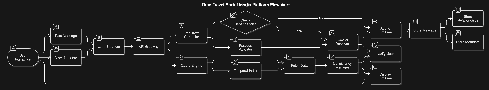

## System Overview

### Users Posting Messages:

- Users post messages either for the past, present, or future.

### Timelines and Dependencies:

- Messages can influence other messages.
- We must ensure the timeline makes logical sense (cause before effect).

### Conflict Resolution:

- If two posts conflict or create paradoxes, we detect and resolve them.

### Consistency:

- Everyone should see the same timeline, regardless of when or where they access the app.

## Key Components

### Frontend (User Interface):

- Allows users to post messages for any time and view a timeline.
- Displays posts in an order that makes sense (no weird jumps or inconsistencies).

### Backend:

- Processes messages and determines their position in the timeline.
- Resolves conflicts and paradoxes.
- Ensures timelines remain consistent for all users.

### Database:

- Stores:
  - Messages with their timestamps (past, present, future).
  - Relationships between messages (e.g., which message influenced another).
  - Tracks metadata (e.g., who posted, when).

### Conflict Resolver:

- Detects and fixes:
  - Paradoxes (e.g., loops in cause-and-effect relationships).
  - Conflicting messages (e.g., two messages for the same time).

### Distributed System:

- Ensures the app works for users across multiple servers and locations.
- Synchronizes data between servers to maintain consistency.

## Diagram Structure

1. **User Interaction (Frontend)**

   - Users interact with the app:
     - Post messages (past, present, future).
     - View the timeline.

2. **Backend Logic**

   - When a user posts:
     - The API Gateway receives the request.
     - A Time Travel Controller processes the message and checks:
       - Does the message depend on other messages?
       - Does it create conflicts or paradoxes?
     - If yes, the Conflict Resolver kicks in to handle it.

3. **Database**

   - The database stores:
     - Messages with timestamps.
     - Relationships (cause-effect links).
     - Metadata (e.g., visibility rules for future/past messages).

4. **Timeline Viewer**
   - When users view the timeline:
     - A Query Engine fetches the data.
     - The Consistency Manager ensures the order of messages is logical and conflict-free.

## Step-by-Step Diagram Explanation

### Frontend:

- Users post messages or view their timeline.
- Sends requests to the backend.

### API Gateway:

- Acts as the entry point for all requests (post/view).

### Time Travel Controller:

- Processes each message to:
  - Add it to the timeline.
  - Check if it conflicts with existing messages.

### Conflict Resolver:

- Fixes issues like:
  - Messages appearing in the wrong order.
  - Circular dependencies.

### Database:

- Stores everything: messages, relationships, and metadata.

### Timeline Viewer:

- Fetches and displays the timeline logically.

